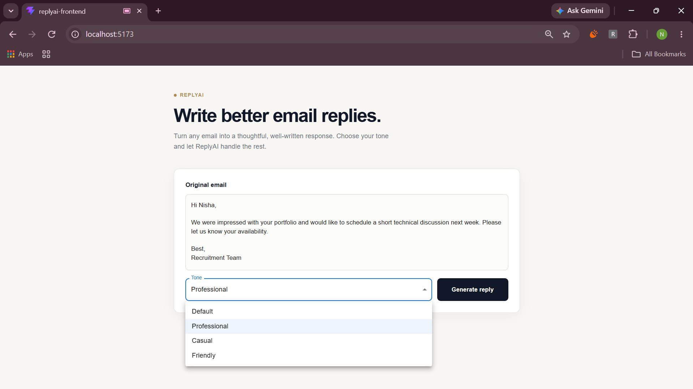
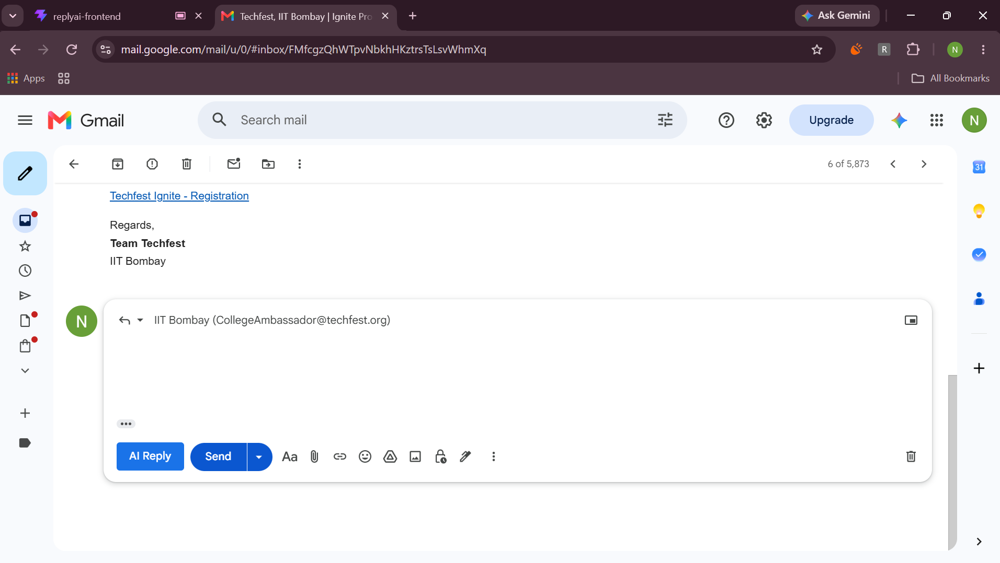
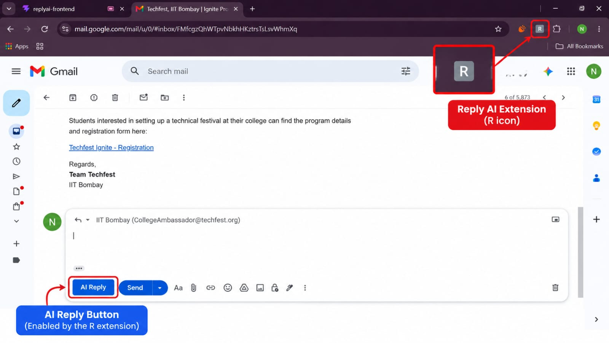

# 📧 Reply AI – Intelligent Email Assistant

Reply AI is a full-stack AI-powered email assistant that generates professional email replies using Large Language Models (LLMs). It streamlines email communication by generating context-aware responses directly from the provided email content.

The project consists of three components:

- 🌐 React Frontend
- ☕ Spring Boot Backend
- 🧩 Chrome Extension for Gmail Integration

---
## 📸 Preview

<p align="center">
  
  
  
</p>

---

## 🚀 Features

- Generate AI-powered email replies
- Multiple reply tones (Professional, Friendly, Casual, Formal, etc.)
- Chrome Extension integration for Gmail
- Clean and responsive Material UI interface
- Copy generated replies with a single click
- REST API architecture
- Fast and user-friendly experience

---

## 🛠️ Tech Stack

### Frontend
- React.js
- Vite
- Material UI (MUI)
- Axios

### Backend
- Spring Boot
- Java
- REST APIs
- Maven

### AI Model
- Google Gemini API
- OpenAI / ChatGPT (LLM-based response generation)

### Browser Extension
- JavaScript
- HTML
- CSS
- Chrome Extension Manifest V3

---

## 📁 Project Structure

```
Reply-AI/
│
├── reply-ai/              # Spring Boot Backend
│
├── replyAi-frontend/      # React Frontend
│
└── email-writer-ext/      # Chrome Extension
```

---

## ⚙️ Installation

### 1. Clone the Repository

```bash
git clone https://github.com/<your-username>/mail-assist.git
```

```bash
cd mail-assist
```

---

## Backend Setup

Navigate to the backend folder.

```bash
cd reply-ai
```

Run the Spring Boot application.

```bash
./mvnw spring-boot:run
```

or

```bash
mvn spring-boot:run
```

The backend runs on:

```
http://localhost:8080
```

---

## Frontend Setup

Navigate to the frontend.

```bash
cd replyAi-frontend
```

Install dependencies.

```bash
npm install
```

Start the development server.

```bash
npm run dev
```

Frontend runs on:

```
http://localhost:5173
```

---

## Chrome Extension Setup

1. Open Chrome.
2. Go to

```
chrome://extensions
```

3. Enable **Developer Mode**.
4. Click **Load Unpacked**.
5. Select the

```
email-writer-ext
```

folder.

The extension is now ready to use.

---

## How It Works

1. User enters or selects an email.
2. Frontend sends the email content to the Spring Boot backend.
3. Backend communicates with the configured Large Language Model.
4. AI generates an appropriate email reply.
5. Response is returned to the frontend or Chrome extension.
6. User can copy and use the generated reply instantly.

---

## API Endpoint

### Generate Email Reply

```
POST /api/email/generate
```

### Request

```json
{
  "emailContent": "Your received email...",
  "tone": "Professional"
}
```

### Response

```text
Generated email reply...
```

---

## Future Improvements

- Multiple AI provider support
- Reply history
- User authentication
- Reply templates
- Dark mode
- Export generated replies
- Tone customization
- Multi-language support

---

## Author

**Nisha Mishra**

---

## License

This project is developed for educational and learning purposes.
